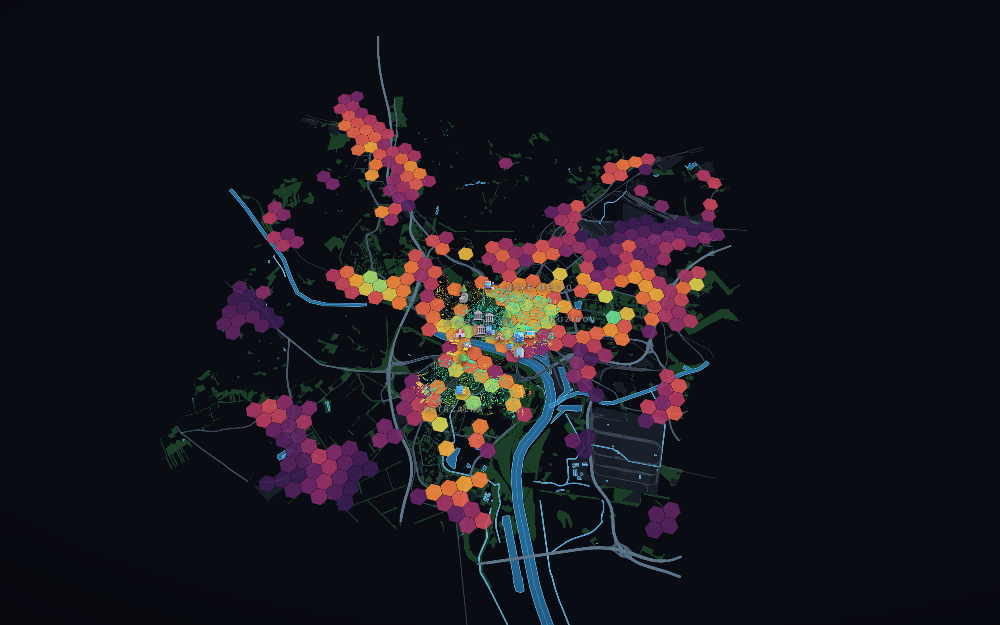

# Bratislava 3D — Atlas kvality života

Interaktívny **3D atlas kvality života** Bratislavy z otvorených geodát
(OpenStreetMap), vyrenderovaný priamo v prehliadači — žiadna podkladová mapa,
žiadny API kľúč. **Šesť urbanistických rozmerov** spojených do jedného
**Indexu kvality miesta** nad obytným územím celého mesta.

**▶ Živá ukážka: https://leumasdam.github.io/bratislava-3d/**



## Atlas — 6 rozmerov kvality

Každý hexagón obytného územia má skóre 0–100 v šiestich nezávislých analýzach:

| Rozmer | Čo meria |
|---|---|
| 🕒 **Dostupnosť** | 15-min dostupnosť 7 denných potrieb pešo |
| 🌳 **Zeleň** | zelená rovnosť — podiel a blízkosť zelene |
| 🌡️ **Tepl. komfort** | pomer zelene/vody voči betónu (proxy tepelného ostrova) |
| 🚊 **MHD** | **reálne frekvencie z GTFS DPB** (1 348 zastávok, 481 tis. spojov/deň) |
| 🚶 **Chodeckosť** | jemnosť uličnej siete, bariéry diaľnic |
| 🔇 **Pokoj** | inverz dopravného hluku (vzdialenosť od ciest/tratí) |

Spoja sa do **Indexu kvality miesta** — a **posuvníkmi váh** si zvolíš, čo je
pre teba dôležité (mesto sa prepočíta naživo). Klik na hex ukáže celý jeho profil.

## Porovnanie miest

Tá istá 15-min metóda spustená pre 5 stredoeurópskych miest (každé vlastný agent):

| Mesto | % oblastí v 15-min meste |
|---|---|
| Viedeň | 70 % |
| Praha | 70 % |
| Budapešť | 60 % |
| **Bratislava** | **56 %** |
| Brno | 34 % |

Bratislava je **4. z 5** — za Viedňou, Prahou aj Budapešťou, no pred Brnom.

## Plánovacie pieskovisko

Atlas mesto nielen opisuje, ale ho necháva **meniť**: v režime plánovača klikneš
a *postavíš* škôlku/lekára/zastávku/park — a nástroj **okamžite prepočíta dopad
v ľuďoch** („novo dostupné pre 3 400 obyvateľov do 15 min"). Tlačidlo
**„Navrhni najlepšie miesto"** prejde kandidátske lokality a nájde tú, ktorá
pomôže najväčšiemu počtu obyvateľov — decision-support, nie len mapa. Populácia
na hex je **reálna z WorldPop** (100 m raster, navzorkovaný na hexy); analyzovaný
hex-grid pokrýva ~147 tis. obyvateľov (časť mesta, nie celé).

---

## Téza

*„15-minútové mesto"* je urbanistický koncept: dobré miesto na život má školu,
škôlku, lekára, lekáreň, obchod, zastávku a park v pešej dostupnosti. Tento
nástroj to **počíta z reálnych dát** pre **obytné územie celej Bratislavy**
(hexagónová mriežka) a klikom kdekoľvek povie konkrétne, čo tam máš a za koľko minút.

Zistenie: **jadro je hotové 15-minútové mesto, no celomestsky je to inak** —
**58 % obytných oblastí má 6+/7, ale každá štvrtá (24 %) je autozávislá.**
Zelené žiariace centrum vs nízke červené okraje: presne ten kontrast, ktorý
plánovanie rieši.

## Čo to vie

- **Celomestská hex mriežka** dostupnosti — 350 hexagónov nad obytným územím
  (zamaskované na `landuse=residential`, aby polia/lesy nesvietili falošne).
  Výška + farba = index dostupnosti. Z diaľky 3D krajina, pri priblížení sa
  splošti a vystúpi **3D detail jadra** (10 046 budov).
- **Dve šošovky** — zafarbi mesto podľa **15-min dostupnosti** (index 0–100,
  červená → zelená) alebo podľa **výšky zástavby**. Jeden klik mení optiku.
- **Klik kamkoľvek → živá analýza**: „škola 4 min ✓, lekár 18 min ✗… máš 5/7".
  Skutočný výpočet vzdialeností k najbližšej vybavenosti v každej kategórii.
- **7 kategórií vybavenosti** ako body na mape (1 373 bodov z OSM).
- **Slabé miesta** — jedným prepínačom stlmíš dobre obslúžené budovy a vytiahneš
  tie pod 6/7; aj v jadre ich pár je.
- **3D budovy** v reálnych výškach (Eurovea Tower 168 m), zeleň, Dunaj, ulice,
  hranice mestských častí.
- **Orientačné body** (Hrad, Most SNP, Slavín…), **atmosféra** deň/súmrak/noc,
  **sprievodca mestom** s kamerou.

## Stack

| Vrstva | Nástroj | Prečo |
|---|---|---|
| Render | **MapLibre GL JS** | Open-source, **API-kompatibilné s Mapbox GL JS** — skill 1:1 prenosný, ale bez tokenu a bez platobnej karty, nasaditeľné staticky. |
| Dáta | **OpenStreetMap** cez **Overpass API** | Otvorené, aktuálne, s výškami budov. |
| Pipeline | **Python** (`fetch_all.py`) | Multi-endpoint failover + dlaždicovanie ťažkých vrstiev. |
| Hosting | **GitHub Pages** | Statické, zadarmo, bez backendu. |

## Dátová pipeline

```bash
python fetch_all.py          # budovy, zeleň, voda, ulice, hranice → data/*.geojson
python fill_gaps.py          # doplní dlaždice, ktoré pod záťažou zlyhali
python fetch_amenities.py    # vybavenosť v jadre → amenities.geojson
python compute_access.py     # 15-min skóre budov jadra (sc, idx)
python fetch_wiki.py         # fotka + popis pamiatok zo sk.wikipedia
# --- celomestská vrstva ---
python fetch_city_data.py    # vybavenosť + obytné územie cez celé mesto
python make_grid.py          # hex mriežka dostupnosti (maska = residential)
python fetch_city_context.py # Dunaj + hlavné cesty cez celé mesto (skelet)
python fetch_city_land.py    # lesy/zeleň/plochy (terén) cez celé mesto
python make_danube.py        # osi riek → reálna šírka bufferom (shapely)
# --- Atlas: 6 indikátorov (compute_ind_* postavené tímom agentov) ---
python compute_ind_green.py  # zelená rovnosť
python compute_ind_heat.py   # tepelný komfort (proxy ostrova)
python compute_ind_transit.py# kvalita MHD
python compute_ind_walk.py   # chodeckosť
python compute_ind_noise.py  # pokoj (inverz hluku)
python integrate_atlas.py    # spojí 6 rozmerov do grid.geojson + kompozit q_index
```

Verejné Overpass mirrory pod záťažou vracajú 504, preto sťahovanie:

1. **Rotuje cez viacero mirrorov** (`overpass-api.de`, `private.coffee`, …) — keď
   jeden zlyhá, skúsi ďalší.
2. **Dlaždicuje** husté vrstvy (budovy 4×5) — malé dopyty prejdú tam, kde jeden
   veľký vyprší. Štandardný postup pri reálnom priestorovom extrakte.
3. **Odvodzuje výšku** budov z `height` → `building:levels × 3,2 m` → rozumný default.
4. **Zaokrúhľuje** súradnice na 6 desatín (~0,11 m) — menší payload bez straty.

### Analýza dostupnosti (`compute_access.py`)

Pre každú z 10 046 budov sa spočíta vzdialenosť k najbližšej vybavenosti v každej
kategórii (priestorový hash, vzdušná čiara ako **proxy pešej chôdze** — pozri
[CASE_STUDY](CASE_STUDY.md)). Z toho:

- `sc` 0–7 — koľko potrieb je v dochádzkovom polomere (per kategória 400–1000 m),
- `idx` 0–100 — spojitý index blízkosti (3 min vs 12 min sa líši), ním sa farbí mesto.

## Lokálne spustenie

```bash
# stačí statický server (kvôli fetch() na data/*.geojson)
python -m http.server 8000
# → http://localhost:8000
```

## Štruktúra

```
fetch_all.py         geodáta (Overpass → GeoJSON, failover + dlaždice)
fill_gaps.py         doplnenie dlaždíc, ktoré pod záťažou zlyhali
fetch_amenities.py   7 kategórií dennej vybavenosti
compute_access.py    15-min analýza dostupnosti → skóre do budov
index.html           kostra UI
src/app.js           MapLibre scéna, šošovky, klik-analýza, sprievodca
src/style.css        dizajn (dark „model" štýl)
data/*.geojson       geodáta (10 046 budov, 1 373 bodov vybavenosti, …)
shoot.cjs            headless capture hero záberov (puppeteer)
screens/             vyrenderované náhľady
```

## Dáta a licencia

Geodáta © prispievatelia **OpenStreetMap**, licencia **ODbL**.
Kód tohto projektu: MIT.

---

_Portfóliový projekt — Samuel Zenko, 2026. Vizualizácia priestorových dát,
mapové rozhrania, UX/UI._
